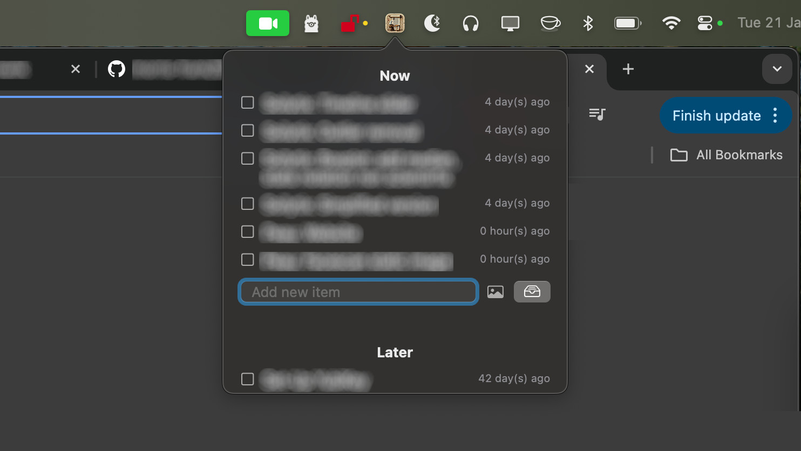

# BarTasks App

## Overview

BarTasks is a lightweight macOS app that resides solely in the system menu bar and allows users to manage simple task lists. The app provides two distinct task lists labeled "Now" and "Later," making it easy to organize and prioritize tasks. The app data persists across reboots using `UserDefaults` for task items.

The app features:

- A menu bar icon for quick access.
- Separate lists for tasks, labeled as "Now" and "Later".
- The ability to add, mark complete, and view deleted items.
- Persistent storage using `UserDefaults` to ensure your tasks remain even after restarting the app.

## Features

- **Menu Bar App**: The app only runs in the macOS menu bar, keeping your Dock clean.
- **Multiple Task Lists**: Manage tasks for different contexts ("Now" and "Later").
- **Persistent Data**: Saves tasks persistently using `UserDefaults` to maintain data across app restarts.
- **Easy Item Management**: Add tasks, mark them complete, and view deleted items in a scrollable panel.

## Installation

To build and run this app:

1. Clone the repository to your local machine.
2. Open the project in Xcode.
3. Build and run the app.
4. The app will appear in the macOS menu bar with a list icon.
